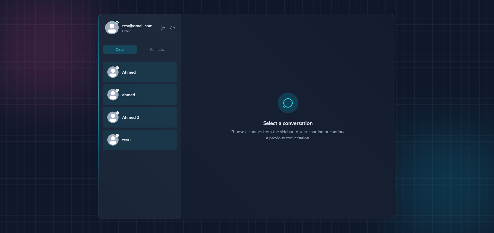
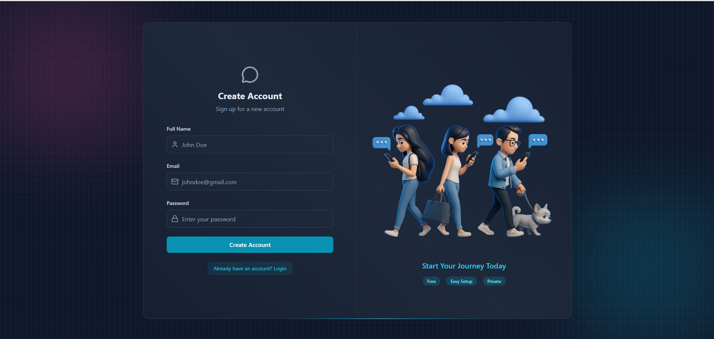

# 💬 Chatify – Real-Time Chat Application

A full-stack **real-time chat application** built with **React.js, Node.js, Express, MongoDB, and Socket.io**.  
Includes authentication, real-time messaging, profile picture uploads (Cloudinary), email notifications (Resend), and Arcjet security.

---

## 🚀 Features

- 🔐 **Authentication** (Signup / Login / JWT cookies)  
- 👤 **Profile Management** (Upload profile pictures via Cloudinary)  
- 📩 **Welcome Emails** using Resend  
- 💬 **Real-Time Messaging** with Socket.io  
- 🟢 **Online Users Tracking**  
- 🔒 **Security** with Arcjet (rate limiting, bot protection)  
- 🎨 **Modern UI** using React + TailwindCSS  
- 🗄 **Database**: MongoDB (Mongoose ODM)  

---

## 🛠 Tech Stack

**Frontend:**  
- React.js (Vite)  
- Zustand (state management)  
- Tailwind CSS  
- Socket.io-client  
- React-hot-toast  

**Backend:**  
- Node.js  
- Express.js  
- MongoDB (Mongoose)  
- Socket.io  
- Cloudinary SDK  
- Resend (Transactional Emails)  
- Arcjet  

---

## ⚙️ Environment Variables

Create a `.env` file in your backend root:

```env
PORT=3000
MONGO_URI=your_mongodb_connection_string
NODE_ENV=development
JWT_SECRET=your_jwt_secret

RESEND_API_KEY=your_resend_api_key
EMAIL_FROM=noreply@yourdomain.com
EMAIL_FROM_NAME=Chatify

CLOUDINARY_CLOUD_NAME=your_cloudinary_cloud_name
CLOUDINARY_API_KEY=your_cloudinary_api_key
CLOUDINARY_API_SECRET=your_cloudinary_api_secret

ARCJET_KEY=your_arcjet_key
ARCJET_ENV=development
```

---

## 🏃‍♂️ Running Locally

### 1. Clone the repository
```bash
git clone https://github.com/oldcodder/chat-app.git
cd chat-app
```

### 2. Install dependencies
For backend:
```bash
cd backend
npm install
```

For frontend:
```bash
cd ../frontend
npm install
```

### 3. Start development servers
Backend:
```bash
npm run dev
```

Frontend:
```bash
npm run dev
```

### 4. Access the app
Open:  
👉 Frontend: `http://localhost:5173`  
👉 Backend API: `http://localhost:3000/api`

---

## 📦 Build for Production

Frontend:
```bash
npm run build
```

Backend (production):
```bash
NODE_ENV=production npm start
```

---

## 📸 Screenshots

](image-1.png)

---

## 📧 Contact

Made with ❤️ by **Muhammad Ahmed**  

- 📩 Email: [ahmedaptechnn@gmail.com](mailto:ahmedaptechnn@gmail.com)  
- 🐙 GitHub: [oldcodder](https://github.com/oldcodder)  
- 💼 LinkedIn: [Muhammad Ahmed](https://www.linkedin.com/in/muhammad-ahmed-frontendengineer/)  

---
